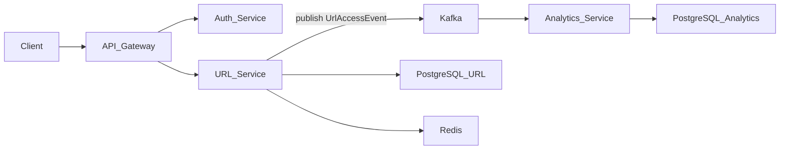
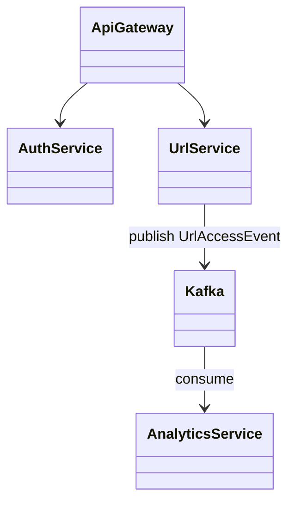

# 🔗 LinkForge — Event‑Driven URL Shortener with Analytics

LinkForge is a **production‑grade, event‑driven URL shortener** designed to demonstrate real‑world backend system design.

The project focuses on **depth over breadth**, implementing industry practices such as API Gateway security, JWT authentication, Kafka‑based async analytics, retries with DLT, CQRS‑style read models, and idempotent consumers.

---

## 🎯 Objectives

* Build a **realistic microservices system**
* Apply **industry‑standard backend patterns** end‑to‑end
* Understand *why* architectural decisions are made
* Gain hands‑on experience with **event‑driven analytics**

---

## 🏗️ High‑Level Design (HLD)

### Architecture Overview



### Key Design Decisions

| Area        | Decision                  | Reason                                   |
| ----------- | ------------------------- | ---------------------------------------- |
| Entry point | API Gateway               | Centralized auth, rate limiting, logging |
| Security    | JWT validation at gateway | Downstream services stay stateless       |
| Analytics   | Kafka async pipeline      | Non‑blocking, scalable writes            |
| Data        | Separate analytics DB     | CQRS read model                          |
| Reliability | Retry + Dead Letter Topic | Failure isolation                        |
| Consistency | DB‑level UPSERT           | Idempotent Kafka consumption             |

---

## 🧩 Low‑Level Design (LLD)

### Service Structure

```text
backend/
 ├── api-gateway/
 │    ├── security/
 │    │    └── JwtValidationFilter
 │    ├── ratelimit/
 │    └── routes/
 │
 ├── auth-service/
 │    ├── controller/
 │    ├── service/
 │    ├── repository/
 │    ├── security/
 │    └── model/
 │
 ├── url-service/
 │    ├── controller/
 │    ├── service/
 │    ├── repository/
 │    ├── kafka/
 │    └── model/
 │
 └── analytics-service/
      ├── consumer/
      ├── repository/
      ├── model/
      ├── dlt/
      └── api/
```

### LLD Diagram



---

## 🔐 Authentication & Security

* **JWT Access Tokens**
* **Opaque Refresh Tokens (DB‑backed, revocable)**
* JWT **validated at API Gateway**
* User context forwarded via headers (`X-User-Id`)

Why gateway validation?

* Avoid repeated JWT parsing
* Enforce separation of concerns
* Reduce downstream coupling

---

## 🔄 Event‑Driven Analytics Flow

```text
Redirect Request
 → URL Service
 → Publish UrlAccessEvent
 → Kafka Topic
 → Analytics Consumer
 → UPSERT into Read Models
```

### Kafka Design Choices

* **At‑least‑once delivery** assumed
* **Idempotent DB writes** using UPSERT
* **Retry with backoff** for transient failures
* **Dead Letter Topic (DLT)** for poison messages

---

## 📊 Analytics Read Model (CQRS)

Raw events are never queried directly.
Instead, we maintain **materialized read models**.

### Tables

* `url_analytics` — summary per URL
* `url_daily_analytics` — time‑series data

Why this approach?

* Fast dashboard queries
* Cheap aggregation
* Safe Kafka replays

---

## 🌐 API Endpoints

### Auth Service

| Method | Endpoint        | Description          |
| ------ | --------------- | -------------------- |
| POST   | `/auth/signup`  | User registration    |
| POST   | `/auth/login`   | Login, issue tokens  |
| POST   | `/auth/refresh` | Refresh access token |

---

### URL Service

| Method | Endpoint     | Description                  |
| ------ | ------------ | ---------------------------- |
| POST   | `/url`       | Create short URL (protected) |
| GET    | `/u/{alias}` | Redirect to original URL     |

---

### Analytics Service

| Method | Endpoint                         | Description         |
| ------ | -------------------------------- | ------------------- |
| GET    | `/analytics/url/{alias}/summary` | Total clicks        |
| GET    | `/analytics/url/{alias}/daily`   | Daily stats         |
| GET    | `/analytics/url/{alias}/monthly` | Monthly aggregation |

---

## 🗄️ Database Design (dbdiagram.io)


## 🧪 Reliability & Failure Handling

* Kafka retry with exponential backoff
* Dead Letter Topic for malformed events
* Offset management per consumer group
* Idempotent writes to survive replays

This ensures **forward progress under failure**.

---

## 🚀 Tech Stack

* **Backend:** Java, Spring Boot, Spring Security, Spring Cloud Gateway
* **Messaging:** Apache Kafka (WSL‑based)
* **Databases:** PostgreSQL, Redis
* **Auth:** JWT, Refresh Tokens
* **Observability:** Actuator (Micrometer ready)
* **Docs:** Swagger / OpenAPI
* **Frontend (planned):** React

---

## 📌 Key Takeaways

* Designed a **production‑style microservices system**
* Implemented **event‑driven analytics with Kafka**
* Applied **CQRS and idempotent consumer patterns**
* Built with **failure handling and scalability in mind**

